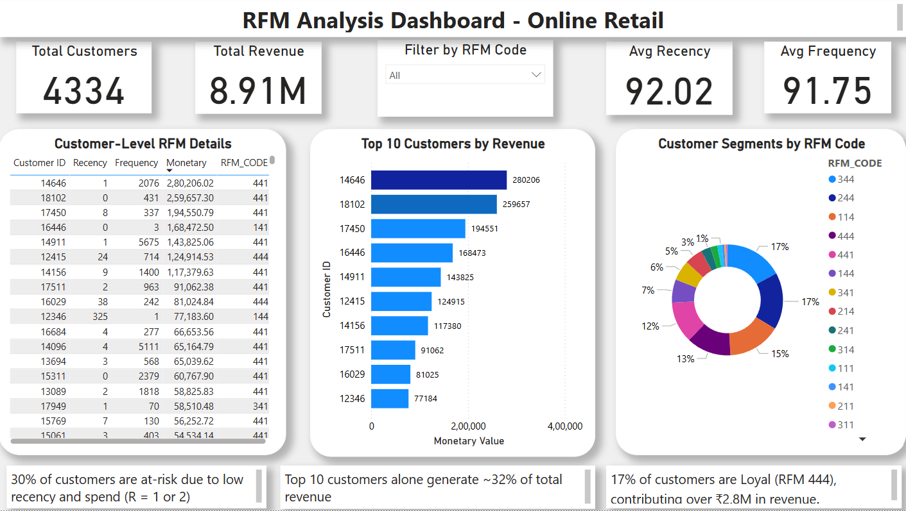

# 📊 RFM Customer Segmentation – Power BI Dashboard

This project performs **RFM (Recency, Frequency, Monetary)** analysis to segment customers based on behavioral data from the **UCI Online Retail dataset**.

RFM scores were calculated in Excel, and visualized using Power BI.

---

## ✅ Tools Used
- **Excel** – Data cleaning, RFM scoring
- **Power BI** – Dashboard development and business insights
- **SQL** – (Coming soon)

---

## 🖼️ Dashboard Preview

---

## 📌 Key Insights
- 🟢 Loyal customers (RFM 444) = 17% of total customers
- 💰 Top 10 customers generate ₹2.8M+ in sales
- 🔻 30% of customers at risk (low recency score)

---

## 📁 Files Included

| File | Description |
|------|-------------|
| `RFM_FINAL1.zip` | 📥 Zipped Excel file with RFM scores (Unzip to view) |
| `RFM_Dashboard.pbix` | Power BI dashboard file |
| `dashboard.png` | Dashboard screenshot preview |

---

## 🔄 Coming Soon

- `rfm_additional_insights.sql` – SQL queries: top countries, monthly revenue, churn
- PPT deck for storytelling and presentation

---

## 👩‍💼 Author

**Megha Soni**  
📧 meghasoni.me@gmail.com  
🔗 [LinkedIn Profile](https://www.linkedin.com/in/megha-soni-b3271b1a2)
